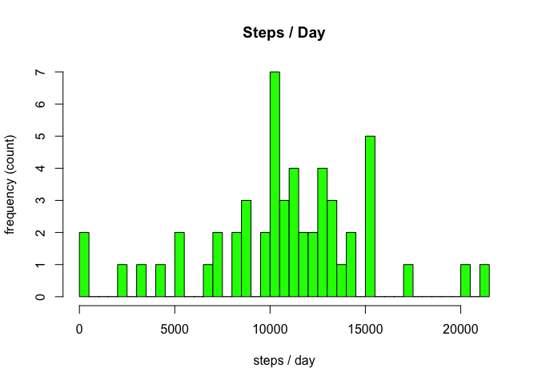
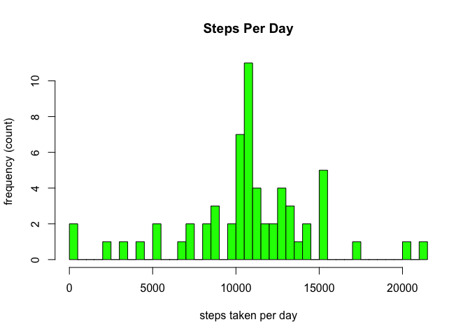

# Reproducible Research: Peer Assessment 1


## Loading and preprocessing the data


```r
  ########## LOAD DATASET ##########
  unzip("activity.zip")
  dataSet <- read.csv("./activity.csv",header = TRUE)
  dataSet <- data.frame(dataSet)
```


## What is mean total number of steps taken per day?

### 1. Make a histogram of the total number of steps taken each day


```r
  ### collapse to individual days ###
  sumDataSet <- aggregate(. ~ date, dataSet, FUN = sum, na.rm = TRUE)

  ### histogram of the frequency of the number of steps taken each day ###
  hist(sumDataSet$steps, breaks = 53, xlab = "steps / day", ylab = "frequency (count)", main = "Steps / Day", col = "green")
```

 


### 2. Calculate & report the mean and median total number of steps taken per day

### Mean Number of Steps
##### The mean number of steps taken per day is: 

```r
  ### report the mean steps per day ###
  meanSteps <- round(mean(sumDataSet$steps)) 
  meanSteps 
```

```
## [1] 10766
```


### Median Number of Steps
#### The median number of steps taken per day is:

```r
  ### report the median steps per day ###
  medianSteps <- round(median(sumDataSet$steps))
  medianSteps 
```

```
## [1] 10765
```


## What is the average daily activity pattern?

### 1. Make a time series plot of the 5 minute interval (x-axis) and the average number of steps taken, averaged across all days (y-axis)


```r
  ### plot the average (mean) number of steps taken per interval ###
  meanInterval <- aggregate(. ~ interval, dataSet, FUN = mean, na.rm = TRUE)
  plot(meanInterval$interval, meanInterval$steps, type="l", ylab="Average Number of Steps Taken", xlab= "5 minute interval", main = "Daily Activity Pattern", bg = "white")
```

 


### 2. Which 5-minute interval, on average acdross all the days in the dataset, contains the maximum number of steps?


#### The 5-minute interval with the maximum number of steps is:

```r
  ### 5-minute interval with maximum number of steps ###
  maxMeanInterval <- meanInterval[which.max(meanInterval$steps), ]$interval
  maxMeanInterval
```

```
## [1] 835
```


## Imputing missing values

### 1. Calculate and report the total number of missing values in the dataset
#### The total number of missing values is:

```r
  ### calculate & report the total number of missing values ###
  countNAs <- sum(is.na(dataSet$steps))
  countNAs
```

```
## [1] 2304
```
  

### 2. Fill in all of the missing values with the mean number of steps taken per interval

```r
  ### fill in the missing values with the mean number of steps taken per interval ###
  FilledDataSet <- merge(dataSet, meanInterval, by = "interval", suffixes = c("", ".y"))
  NAs <- is.na(FilledDataSet$steps)
```

### 3. Create a new dataset that is equal to the original dataset but with the missing values filled in

```r
  FilledDataSet$steps[NAs] <- FilledDataSet$steps.y[NAs]
  FilledDataSet <- FilledDataSet[ , c(1:3)]
```


### 4A. Make a histogram of the total number of steps taken each day

```r
  ### collapse to individual days ###
  sumFilledDataSet <- aggregate(. ~ date, FilledDataSet, FUN = sum)
  
  ### histogram of the frequency of the number of steps taken each day ###
  hist(sumFilledDataSet$steps, breaks = 53, xlab = "steps taken per day", ylab = "frequency (count)", main = "Steps Per Day", col = "green")
```

 

### 4B. Calculate & report the mean and median total number of steps taken per day

### Mean Number of Steps
##### The mean number of steps taken per day is: 

```r
  ### report the mean steps per day ###
  meanFilledSteps <- round(mean(sumFilledDataSet$steps))
  meanFilledSteps
```

```
## [1] 10766
```

### Median Number of Steps
##### The median number of steps taken per day is: 

```r
  ### report the median steps per day ###
  medianFilledSteps <- round(median(sumFilledDataSet$steps))
  medianFilledSteps
```

```
## [1] 10766
```

### 4C. What is the impact of imputing missing data on the estimates of the total daily number of steps?  
#### The impact of imputing missing data is that the values for the median and the mean are closer to one another.  In this case, they are identical when rounded to the nearest number of steps.


## Are there differences in activity patterns between weekdays and weekends?

### 1. Create a new factor variable in the dataset with two levels - weekday and weekend

```r
  ### create a new column indicating the day of the week
  day <- function(date) 
    {
    if (weekdays(as.Date(date)) %in% c("Saturday", "Sunday")){ "weekend"}
    else { "weekday"}
    }
  
  FilledDataSet$day <- as.factor(sapply(FilledDataSet$date, day))
```


### 2. Make a panel plot containing a time series plot of the 5-minute interval (x-axis) and the average number of steps taken, averaged across all weekday days and weekend days (y-axis)


```r
  ### create a two plot panel one for weekends the other for weekdays ###
  
  # create weekend and weekday subsets #
  weekendDataSet <- subset(FilledDataSet, day %in% "weekend")
  weekdayDataSet <- subset(FilledDataSet, day %in% "weekday")
  
  # aggregate number of steps taken per interval for each subset #
  meanWeekendInterval <- aggregate(. ~ interval, weekendDataSet, FUN = mean)
  meanWeekdayInterval <- aggregate(. ~ interval, weekdayDataSet, FUN = mean)
  
  # plot the average (mean) number of steps taken per interval for each subset #
  par(mfrow = c(2,1))
  plot(meanWeekendInterval$interval, meanWeekendInterval$steps, type="l", ylab="Steps", xlab= "Interval", main = "Weekend", bg = "white")
  plot(meanWeekdayInterval$interval, meanWeekdayInterval$steps, type="l", ylab="Steps", xlab= "Interval", main = "Weekday", bg = "white")
```

 
